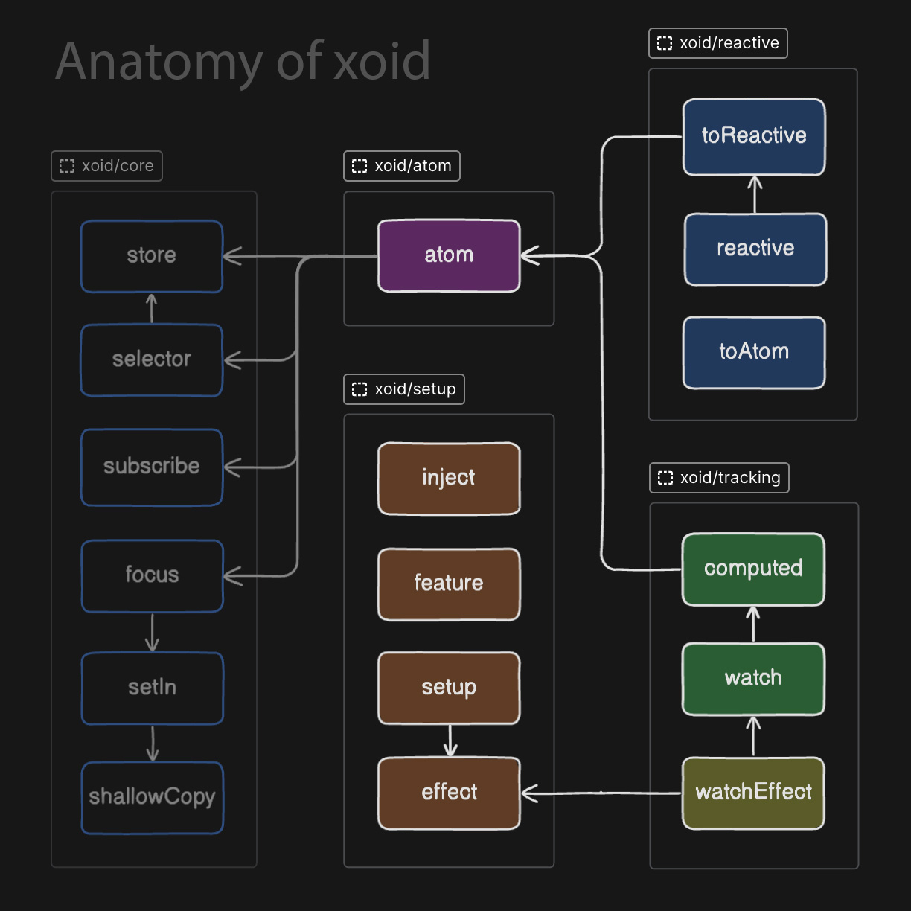

## APIs that make up **xoid**

**xoid** has 2 major APIs. These are:

- State management API
- Setup API

#### **State management API** 

This API can be studied in 3 subsections:
  - `atom` 
  - Tracking API (`computed`, `watch`)
  - Reactive API (`reactive`, `toReactive`, `toAtom`)

The most important function here is `atom`. Using the rest of them is just a matter of preference, and it will not improve the potency of what you can do with **xoid**. `atom` alone is already a capable primitive. The rest are solely DX enhancements that make use of techniques such as implicit dependency tracking and ES6 proxies.

#### **Setup API**

This API is one of the most unique things about **xoid**. With this API, **xoid** is almost like a framework without the markup/DOM part. This API is mostly used for it's two helpers, `inject` and `effect`. They are usually used for writing component logic, however they're not only limited to components. Here are the framework specific APIs they correspond to:

|  xoid |  React |  Vue |  Svelte |
|---|---|---|---|
 | `effect` | `useEffect` | `onMounted`, `onUnmounted` | `onMount`, `onDestroy` |
 | `inject` | `useContext` | `inject` | `getContext` |

`effect` and `inject` can be used to move business logic out of components in a **truly** framework-agnostic manner. They're usually used within `useSetup` or `setup`'s context. `setup` can be used to test component logic without importing any UI framework. 

## Different ways of adopting **xoid**

**xoid** is nicely tree-shakable. You can opt-out of any of the exports and the bundle size would be optimal. You can even use only the setup API, and use the state containers from another state manager. Here, different ways of adopting **xoid** is listed. In the next section, there's a list of the final bunde sizes of these scenarios.

### 1. `atom`

You can choose to adopt **xoid** minimally and use only the `atom` export. This means you're choosing an immutable style of coding with explicit subscriptions. This would be suitable for developers that are most comforable with **React**/**Redux** style of state management.

### 2. `atom` + Tracking API

You can add the tracking API to your toolset. These are two additional functions called `computed` and `watch`. They have the capability of implicitly tracking the atoms when the `.value` getter is used inside their callbacks. 

### 3. `atom` + Tracking API + Reactive API

`reactive` makes use of ES6 proxies and it can make working with nested state easier. Members of the tracking API are also capable of tracking the reactive proxies that are created with it. This would give a similar experience to **Vue 3**'s `reactive` export, **MobX**, and **Valtio**.

### 4. (advanced, undocumented) Core API

In the `xoid/core` route, utils that make up the `atom` function are exported. You can use these if you want even better tree-shaking.

<table>

<tr><td>

</td>

<td>

🟪 `atom`

🟦 Reactive API

🟩 Tracking API

🟨 `watchEffect`*

🟧 Setup API

</td></tr>
</table>

`watchEffect` is a shorthand for: `effect(() => watch(callback))` and can be considered as a member of both the tracking and setup APIs.

| Exports  | Legend       | Gzipped size |  |
| ---- | --- | --- | --- |
| `atom` | 🟪  | 0.76kB  |  |
| `atom, computed, watch`  | 🟪 + 🟦   | 0.79kB                   |  |
| `atom, computed, watch, reactive, toReactive, toAtom` | 🟪 + 🟦 + 🟩    | 0.86kB |  | 
| `effect, inject, feature, setup` | 🟧  | 0.21kB                   |  |
| `*` (All exports) | 🟪 + 🟦 + 🟩 + 🟨 + 🟧                       | 1.05kB                   |  |
